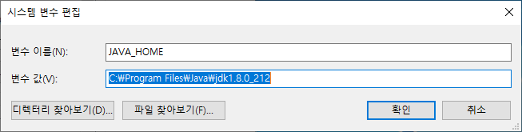
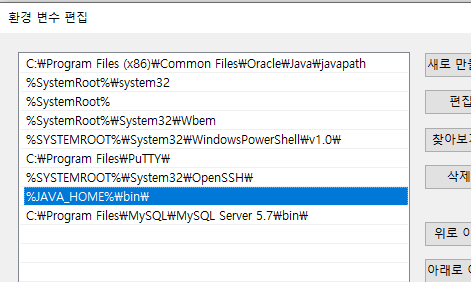

# 개발환경 설치 및 설정

## 개발환경 설정
### JDK
  * JDK 1.8.0 설치 후 Java bin 폴더 Path 지정
  
  
### Spring Tool Suite
  > Spring Legacy Project => STS 3.X까지만 지원(4.X부턴 Spring Boot만)

  * Encoding UTF-8 설정
    * Window -> Preferences
      * General -> Workspace -> Text file encoding - Other : UTF-8
      *  Web -> CSS, HTML, JSP -> Encoding - ISO 10646/Unicode(UTF-8)
      *  XML -> XML -> Encoding - ISO 10646/Unicode(UTF-8)
  * STS 경로에 영어만 있도록 할 것

### Apache Tomcat
    * 특별한 설치방법은 없지만 서비스가 켜져 있으면 Port 충돌 -> 서비스 끌 것

## 프로젝트 설정
### 템플릿 종류
  * File => New => Spring Legacy Project => Spring MVC Project

### 스프링, 자바, 서블릿 버전

  | <center>종류</center> | <center>권장 버전</center> |
  | :---: | :---: |
  | 스프링 | Ver 4 이상 |
  | 자바 | Ver 1.8 이상 |
  | 서블릿 | Ver 3.1 이상 |


### 라이브러리
  * Pom.xml에 dependency 추가 - [Mvnrepository.com](https://mvnrepository.com/)
  * 라이브러리 설치 목록
    * MyBatis
    * MyBatis-Spring
    * HikariCP
    * Log4jdbc
    * Spring tx, Spring jdbc, Spring test
    * Lombok
      * [Lombok 공식 홈페이지](https://projectlombok.org/)에서 Lombok 다운로드 후 설치

### Junit 설정
  * Pom.xml Junit 버전 최신화
  ```xml
  <dependency>
			<groupId>junit</groupId>
			<artifactId>junit</artifactId>
			<version>4.12</version>
			<scope>test</scope>
	</dependency>
  ```

### MySQL 설정
  * MySQL Connector, HikariCP, Mybatis 연동
    * root-context.xml beans에 Mybatis-Spring 추가
      * hikariConfig : DB 드라이버, 아이디, 비밀번호 지정
      ```xml
      <!-- Root Context: defines shared resources visible to all other web components -->
      <bean id="hikariConfig" class="com.zaxxer.hikari.HikariConfig">
        <property name="driverClassName" value="net.sf.log4jdbc.sql.jdbcapi.DriverSpy"></property>
        <property name="jdbcUrl" value="jdbc:log4jdbc:mysql://localhost:3306/jsw02?autoReconnect=true&amp;useSSL=false&amp;useUnicode=true&amp;characterEncoding=UTF-8"></property>
        <property name="username" value="jsw02"></property>
        <property name="password" value="jsw02"></property>
      </bean>
      ```

      * dataSource : hikariConfig 참조
      ```xml
      <!-- HikariCP Config -->
    	<bean id="dataSource" class="com.zaxxer.hikari.HikariDataSource" destroy-method="close">
    		<constructor-arg ref="hikariConfig" />
    	</bean>
      ```

      * sqlSessionFactory : MyBatis SqlSession => property : dataSource
      ```xml
      <bean id="sqlSessionFactory" class="org.mybatis.spring.SqlSessionFactoryBean">
    		<property name="dataSource" ref="dataSource"></property>
    	</bean>
      ```
    * Encoding Filter 설정
      * Web.xml 내에 <filter> 항목에 설정
      * org.springframework.web.filter.CharacterEncodingFilter 사용
      * 기본 UTF-8 설정 : 유니코드 형태 문자변환공식
      ```xml
      ...
      <filter>
  		<filter-name>encoding</filter-name>
  		<filter-class>org.springframework.web.filter.CharacterEncodingFilter</filter-class>
    		<init-param>
    			<param-name>encoding</param-name>
    			<param-value>UTF-8</param-value>
    		</init-param>
  	   </filter>

    	<filter-mapping>
    		<filter-name>encoding</filter-name>
    		<url-pattern>/*</url-pattern>
    	</filter-mapping>
      ...
      ```
